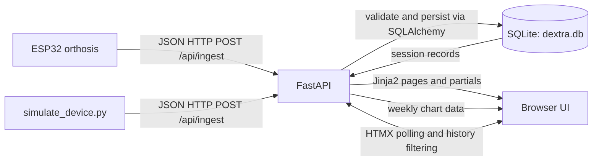

# Dextra Rehab Dashboard

Dextra is a demo application for a switch-controlled wrist-hand orthosis. An ESP32 sends a completed exercise session to a FastAPI backend, which stores the measurements and presents progress, session history, achievements, and exercise information in a browser.

This is a single-patient prototype, not a clinical product. It has no login or transport encryption; use demo data only.

## Architecture



The FastAPI app creates the SQLite tables and seeds the exercise library at startup. `POST /api/ingest` validates a session, assigns it to the fixed demo patient `usr_9876`, and writes it to SQLite. The server-rendered Jinja2 pages read those records to compute dashboard metrics and render the history, achievements, and exercise library. HTMX refreshes dashboard statistics and recent sessions every five seconds; Chart.js draws the weekly activity chart.

## Requirements

- Python 3.11 or newer
- A local browser
- For the physical device: Arduino IDE or Arduino CLI, an ESP32 board, and the ArduinoJson library

## Setup

From the project root, create and activate a virtual environment.

Windows PowerShell:

```powershell
py -3.11 -m venv .venv
.\.venv\Scripts\Activate.ps1
```

macOS or Linux:

```bash
python3 -m venv .venv
source .venv/bin/activate
```

Install the application and test dependencies:

```shell
python -m pip install --upgrade pip
python -m pip install -r requirements.txt
python -m pip install "uvicorn[standard]" httpx pytest
```

The database file `dextra.db` is created in the current working directory when the app starts. Exercise-library starter records are inserted automatically; session history is not cleared on restart.

Vercel detects the FastAPI app from `app/main.py` and installs its runtime dependencies from `requirements.txt`. There, the demo SQLite database uses `/tmp` because the deployment bundle is read-only. That storage is temporary and may differ between function instances, so use a managed database for durable session history.

## Run the App

Start the server from the project root:

```shell
python -m uvicorn app.main:app --reload --host 127.0.0.1 --port 8000
```

Open [http://127.0.0.1:8000](http://127.0.0.1:8000) for the dashboard. The interactive API schema is at [http://127.0.0.1:8000/docs](http://127.0.0.1:8000/docs), and [http://127.0.0.1:8000/health](http://127.0.0.1:8000/health) returns `{"status":"ok"}` when the server is available.

Available pages:

- `/` - dashboard and weekly activity
- `/history` - session history with exercise-type filtering and pagination
- `/achievements` - unlocked badges and progress toward locked badges
- `/exercises` - exercise library; open an exercise for instructions and related session stats

Run the tests from the project root:

```shell
python -m pytest tests/test_app.py -q
```

## Run the Device Simulator

Keep the app running, open a second terminal at the project root, activate the same virtual environment, then send one realistic session:

```shell
python simulate_device.py --once
```

To add a backdated history spanning 14 days for a fuller dashboard demo:

```shell
python simulate_device.py --seed 14
```

`--seed N` posts one or two generated sessions per day across the requested period. It appends records; it does not clear existing history, so seed a demo database only once unless duplicates are intentional. The simulator posts to `http://localhost:8000/api/ingest`.

## Connect an ESP32

1. Install ArduinoJson in the Arduino environment.
2. In `esp32_session.ino`, set `WIFI_SSID`, `WIFI_PASSWORD`, and `SERVER_IP`. `SERVER_IP` must be the computer's LAN IPv4 address, not `127.0.0.1`.
3. Start Uvicorn so other devices on the local network can reach it:

   ```shell
   python -m uvicorn app.main:app --host 0.0.0.0 --port 8000
   ```

4. Put the computer and ESP32 on the same network, allow inbound TCP port 8000 through the computer's firewall if prompted, then flash the sketch.
5. Open the serial monitor at 115200 baud. The sketch starts a session on boot; hold its session-end button on GPIO 27 for two seconds to POST the session.

The firmware currently leaves `noteSwitchActivation()` and `noteSuccessfulRep()` as integration hooks and sets `MAX_FORCE_N` to `0.0`. Connect those values to the orthosis switch, servo, and force-sensor logic before treating hardware measurements as meaningful. HTTP traffic is unauthenticated and unencrypted; use only a trusted demo network and non-sensitive data.

## Ingestion API

`POST /api/ingest` accepts a JSON object with this shape:

```json
{
  "device_id": "DEXTRA_ESP_01",
  "patient_id": "usr_9876",
  "session_type": "wrist_extension",
  "duration_seconds": 180,
  "switch_activations": 12,
  "successful_reps": 10,
  "max_force_n": 15.2,
  "timestamp": "2026-10-07T17:30:00Z"
}
```

`device_id`, `session_type`, `duration_seconds`, and `timestamp` are required. `timestamp` must be an ISO 8601 datetime. `patient_id` defaults to `usr_9876`, and the server currently assigns every ingested session to that patient even if another ID is submitted. `switch_activations` and `successful_reps` default to `0`; `max_force_n` defaults to `0.0`.

On success, the API returns the stored session fields and its generated database `id`. The dashboard calculates success rate as `successful_reps / switch_activations` (zero when there are no activations), alongside total reps, average duration, weekly trend, and day streak.